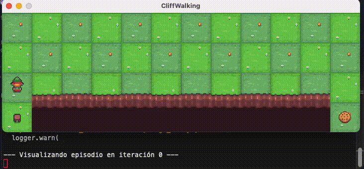

# Introduction to Reinforcement Learning

[](README.md)



This repository contains a modular library of reinforcement learning agents, along with multiple training and experimentation scripts using the `CliffWalking-v0` environment from Gymnasium.

This work is part of the Distributed Intelligent Systems (SID) course at FIB-UPC.

## 🚀 Requirements

* Python 3.11
* Install dependencies with:

```bash
pip install -r requirements.txt
```

> The main dependencies are [`gymnasium`](https://gymnasium.farama.org/) and `pygame` (for visualization).

## 🧠 Available Agents

Each file in `agents/` implements an algorithm:

* `ValueIterationAgent`: Agent that knows the model and performs Value Iteration.
* `DirectEstimationAgent`: Agent that estimates the environment dynamics with random exploration.
* `QLearningAgent`: Agent that learns directly from experience, without knowing the model.

## 🧪 Testing and Experimentation Scripts

* `SCRIPT_[AGENT]_test.py`:
  Runs basic agent training and displays:

  * Learned policy
  * State values
  * Average return per iteration/episode

* `SCRIPT_[AGENT]_experiments.py`:
  Contains more advanced experiments (no script for VI), including:

  * Convergence comparisons
  * Policy evaluation against the optimal
  * Error analysis based on experience, α, ε, decay, etc.
