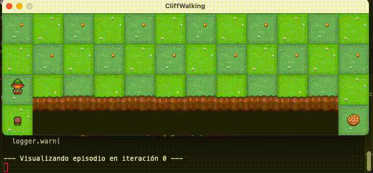

# Introducción al Aprendizaje por Refuerzo

[](README.en.md)



Este repositorio contiene una librería modular de agentes de aprendizaje por refuerzo, así como múltiples scripts de entrenamiento y experimentación con el entorno `CliffWalking-v0` de Gymnasium.

Este trabajo es parte de la asignatura de Sistemas Inteligentes Distribuidos (SID) de la FIB-UPC.

## 🚀 Requisitos

* Python 3.11
* Instalar dependencias con:

```bash
pip install -r requirements.txt
```

> Las dependencias principales son [`gymnasium`](https://gymnasium.farama.org/) y `pygame` (para visualización).

## 🧠 Agentes disponibles

Cada archivo en `agents/` implementa un algoritmo:

* `ValueIterationAgent`: Agente que conoce el modelo y realiza Iteración de Valor.
* `DirectEstimationAgent`: Agente que estima la dinámica del entorno con exploración aleatoria.
* `QLearningAgent`: Agente que aprende directamente de la experiencia, sin conocer el modelo.

## 🧪 Scripts de prueba y experimentación

* `SCRIPT_[AGENTE]_test.py`:
  Ejecuta el entrenamiento básico del agente y muestra:

  * Política aprendida
  * Valores de los estados
  * Retorno promedio por iteración/episodio

* `SCRIPT_[AGENTE]_experiments.py`:
  Contiene experimentos más avanzados (no existe el script para VI), incluyendo:

  * Comparativas de convergencia
  * Evaluación de políticas respecto a la óptima
  * Análisis de errores en función de la experiencia, α, ε, decay, etc.